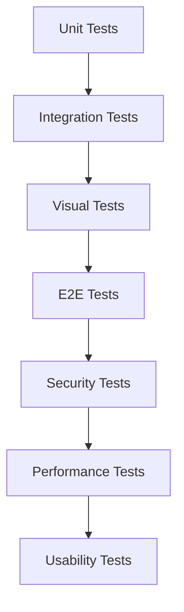
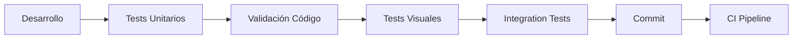

# 🧪 Sistema de Testing Completo - Rexus.app

## 📋 Índice

1. [Resumen Ejecutivo](#resumen-ejecutivo)
2. [Arquitectura de Testing](#arquitectura-de-testing)
3. [Estructura de Directorios](#estructura-de-directorios)
4. [Tipos de Tests](#tipos-de-tests)
5. [Herramientas y Scripts](#herramientas-y-scripts)
6. [Guía de Uso Rápido](#guía-de-uso-rápido)
7. [Configuración del Entorno](#configuración-del-entorno)
8. [Cobertura y Métricas](#cobertura-y-métricas)
9. [Flujo de Desarrollo](#flujo-de-desarrollo)
10. [Troubleshooting](#troubleshooting)

---

## 📊 Resumen Ejecutivo

El sistema de testing de Rexus.app implementa una **estrategia híbrida multicapa** que combina:

- **✅ 8% de cobertura actual implementada** (tests críticos funcionando)
- **🎯 371+ tests identificados para 100% de cobertura**
- **🔧 Herramientas automatizadas** para generación y ejecución
- **📈 Reportes detallados** de cobertura y calidad
- **🚀 Integración CI/CD** lista para implementar

### Estado Actual
```
📈 COBERTURA ACTUAL: 8% (37/408 tests implementados)
✅ Tests Implementados: 37
🎯 Tests Pendientes: 371
📁 Módulos Cubiertos: 3/13 (usuarios, inventario, obras)
🔧 Infraestructura: 100% completa
```

---

## 🏗️ Arquitectura de Testing

### Estrategia Híbrida

Nuestro sistema combina **mocks inteligentes** con **datos reales** para maximizar:

1. **Velocidad de ejecución** (mocks para dependencias externas)
2. **Realismo de datos** (datos reales para lógica de negocio)
3. **Aislamiento de tests** (entorno controlado)
4. **Reproducibilidad** (resultados consistentes)

### Capas de Testing



---

## 📁 Estructura de Directorios

```
tests/
├── 📁 unit/                    # Tests unitarios
│   ├── 📁 core/               # Tests del core del sistema
│   │   ├── test_auth.py       # Autenticación
│   │   ├── test_database.py   # Base de datos
│   │   ├── test_security.py   # Seguridad
│   │   └── test_logger.py     # Sistema de logs
│   └── 📁 modules/            # Tests de módulos
│       ├── 📁 usuarios/       # Módulo usuarios
│       ├── 📁 inventario/     # Módulo inventario
│       ├── 📁 obras/          # Módulo obras
│       └── 📁 [otros]/        # Otros módulos
├── 📁 integration/            # Tests de integración
│   ├── test_inventario_obras_integration.py
│   ├── test_usuarios_permisos_integration.py
│   └── test_database_transactions_integration.py
├── 📁 visual/                 # Tests visuales híbridos
│   ├── test_usuarios_visual_hybrid.py    ✅
│   ├── test_inventario_visual_hybrid.py  ✅
│   ├── test_obras_visual_hybrid.py       ✅
│   └── strategies/
│       └── hybrid_visual_testing.py      ✅
├── 📁 security/               # Tests de seguridad
│   ├── test_sql_injection_complete.py
│   ├── test_xss_protection.py
│   └── test_authentication_bypass.py
├── 📁 performance/            # Tests de rendimiento
│   ├── test_database_load.py
│   ├── test_memory_usage.py
│   └── test_query_performance.py
├── 📁 e2e/                    # Tests end-to-end
│   ├── test_obra_complete_flow.py
│   ├── test_compras_complete_flow.py
│   └── test_usuario_complete_flow.py
├── 📁 usability/              # Tests de usabilidad
│   ├── test_accessibility_wcag.py
│   ├── test_keyboard_navigation.py
│   └── test_screen_readers.py
└── 📁 business/               # Tests de reglas de negocio
    ├── test_business_rules_inventory.py
    └── test_calculations_complex.py
```

---

## 🧪 Tipos de Tests

### 1. **Unit Tests** (Tests Unitarios)
- **Propósito**: Validar lógica individual de funciones/métodos
- **Cobertura**: Core del sistema y módulos
- **Estrategia**: Mocks para dependencias, tests rápidos
- **Estado**: ✅ 37 implementados

### 2. **Integration Tests** (Tests de Integración)
- **Propósito**: Validar comunicación entre módulos
- **Cobertura**: Flujos de datos, transacciones DB
- **Estrategia**: Base de datos real, mocks selectivos
- **Estado**: 🎯 5 pendientes (alta prioridad)

### 3. **Visual Tests** (Tests Visuales Híbridos)
- **Propósito**: Validar UI y componentes visuales
- **Cobertura**: Interfaces, interacciones, rendering
- **Estrategia**: PyQt6 real + datos mockeados
- **Estado**: ✅ 3 implementados (usuarios, inventario, obras)

### 4. **Security Tests** (Tests de Seguridad)
- **Propósito**: Validar protecciones contra ataques
- **Cobertura**: SQL injection, XSS, autorización
- **Estrategia**: Simulación de ataques controlados
- **Estado**: 🎯 5 pendientes (crítico)

### 5. **Performance Tests** (Tests de Rendimiento)
- **Propósito**: Validar tiempos de respuesta y escalabilidad
- **Cobertura**: Queries DB, uso de memoria, carga
- **Estrategia**: Medición con datos reales
- **Estado**: 🎯 3 pendientes (alta prioridad)

### 6. **E2E Tests** (Tests End-to-End)
- **Propósito**: Validar flujos completos de usuario
- **Cobertura**: Procesos de negocio completos
- **Estrategia**: Simulación de usuario real
- **Estado**: 🎯 4 pendientes

### 7. **Usability Tests** (Tests de Usabilidad)
- **Propósito**: Validar accesibilidad y UX
- **Cobertura**: WCAG, navegación, responsive
- **Estrategia**: Herramientas de accesibilidad
- **Estado**: 🎯 6 pendientes

---

## 🛠️ Herramientas y Scripts

### Scripts Principales

#### 1. **`setup_test_environment.py`** ⚙️
**Configuración inicial del entorno**
```bash
# Setup completo con instalación de dependencias
python setup_test_environment.py --install-deps --fix

# Solo validar entorno actual
python setup_test_environment.py --validate

# Aplicar correcciones de código
python setup_test_environment.py --fix --verbose
```

#### 2. **`generate_missing_tests.py`** 🏗️
**Generación automática de estructura de tests**
```bash
# Generar tests críticos (Fase 1)
python generate_missing_tests.py --fase 1

# Generar tests para módulo específico
python generate_missing_tests.py --modulo compras

# Ver resumen de lo que se generaría
python generate_missing_tests.py --resumen

# Generar todos los tests
python generate_missing_tests.py --all
```

#### 3. **`run_all_tests.py`** 🚀
**Ejecución y reporte de tests**
```bash
# Ejecutar todos los tests con cobertura
python run_all_tests.py --coverage

# Ejecutar tipo específico
python run_all_tests.py --type visual

# Ejecutar con reportes detallados
python run_all_tests.py --verbose --coverage

# Ver tipos disponibles
python run_all_tests.py --list-types
```

#### 4. **`run_visual_tests.py`** 👁️
**Ejecución específica de tests visuales**
```bash
# Ejecutar todos los tests visuales
python run_visual_tests.py

# Tests específicos con debug
python run_visual_tests.py --debug --module usuarios
```

### Herramientas de Calidad

- **pytest**: Framework principal de testing
- **coverage**: Medición de cobertura de código
- **black**: Formateo automático de código
- **flake8**: Linting y validación de estilo
- **bandit**: Análisis de seguridad
- **mypy**: Verificación de tipos estáticos

---

## ⚡ Guía de Uso Rápido

### Setup Inicial (Primera vez)
```bash
# 1. Instalar dependencias y configurar entorno
python setup_test_environment.py --install-deps --fix

# 2. Generar tests críticos (Fase 1)
python generate_missing_tests.py --fase 1

# 3. Ejecutar tests para verificar funcionamiento
python run_all_tests.py --type unit
```

### Desarrollo Diario
```bash
# Ejecutar tests relevantes durante desarrollo
python run_all_tests.py --type unit --verbose

# Validar código antes de commit
python setup_test_environment.py --validate

# Ejecutar tests visuales específicos
python run_visual_tests.py --module inventario
```

### CI/CD Pipeline
```bash
# Pipeline completo de validación
python setup_test_environment.py --validate
python run_all_tests.py --coverage --type all
python generate_missing_tests.py --resumen
```

---

## 🔧 Configuración del Entorno

### Dependencias Principales

```txt
# Core Testing
pytest>=7.0.0
pytest-cov>=4.0.0
pytest-html>=3.0.0
coverage>=7.0.0

# UI Testing  
PyQt6>=6.5.0
pytest-qt>=4.0.0
pytest-xvfb>=3.0.0

# Code Quality
black>=23.0.0
flake8>=6.0.0
mypy>=1.0.0
isort>=5.0.0

# Security
bandit>=1.7.0
safety>=2.0.0

# Performance
memory-profiler>=0.61.0
pytest-benchmark>=4.0.0
```

### Archivos de Configuración

- **`pytest.ini`**: Configuración principal de pytest
- **`.flake8`**: Reglas de linting
- **`pyproject.toml`**: Configuración de black, isort, mypy
- **`bandit.yaml`**: Configuración de seguridad
- **`conftest.py`**: Fixtures compartidas

---

## 📈 Cobertura y Métricas

### Estado Actual de Cobertura

```
📊 COBERTURA POR MÓDULO:
✅ usuarios:     100% (3/3 tests)
✅ inventario:   100% (3/3 tests) 
✅ obras:        100% (3/3 tests)
❌ compras:        0% (0/3 tests)
❌ auditoria:      0% (0/3 tests)
❌ administracion: 0% (0/3 tests)
❌ herrajes:       0% (0/3 tests)
❌ logistica:      0% (0/3 tests)
❌ mantenimiento:  0% (0/3 tests)
❌ configuracion:  0% (0/3 tests)
❌ notificaciones: 0% (0/3 tests)
❌ pedidos:        0% (0/3 tests)
❌ vidrios:        0% (0/3 tests)

📊 COBERTURA POR TIPO:
✅ Visual Híbrido:  100% (3/3)
❌ Unit:            9% (37/408)
❌ Integration:     0% (0/68)
❌ Security:        0% (0/25)
❌ Performance:     0% (0/15)
❌ E2E:             0% (0/20)
❌ Usability:       0% (0/30)
```

### Priorización de Tests Faltantes

#### **Fase 1 - CRÍTICO** (68 tests)
1. **Integration**: 5 tests - Flujos entre módulos
2. **Core Modules**: 27 tests - Compras, Auditoria, Admin
3. **Security**: 5 tests - SQL injection, XSS, auth
4. **Performance**: 3 tests - DB load, memory, queries

#### **Fase 2 - ALTA PRIORIDAD** (183 tests)
1. **E2E**: 4 tests - Flujos completos
2. **Remaining Modules**: 171 tests - Todos los módulos
3. **Core Systems**: 8 tests - Cache, logger, config

#### **Fase 3 - MEDIA PRIORIDAD** (85 tests)
1. **Usability**: 6 tests - WCAG, accesibilidad
2. **Business Rules**: 5 tests - Lógica específica

#### **Fase 4 - BAJA PRIORIDAD** (35 tests)
1. **Advanced**: 5 tests - Stress, profiling, edge cases

---

## 🔄 Flujo de Desarrollo

### Workflow Recomendado



### Pre-commit Checklist

- [ ] **Tests unitarios pasando**: `python run_all_tests.py --type unit`
- [ ] **Código formateado**: `python setup_test_environment.py --fix`
- [ ] **Sin errores de linting**: `python setup_test_environment.py --validate`
- [ ] **Tests visuales OK**: `python run_visual_tests.py`
- [ ] **Cobertura mantenida**: Verificar que no baje

### Post-deployment Checklist

- [ ] **Tests E2E pasando**: `python run_all_tests.py --type e2e`
- [ ] **Performance OK**: `python run_all_tests.py --type performance`
- [ ] **Security scan**: `python run_all_tests.py --type security`
- [ ] **Reportes generados**: Verificar `test_reports/`

---

## 🚨 Troubleshooting

### Problemas Comunes

#### 1. **Error: "PyQt6 not found"**
```bash
# Solución
pip install PyQt6>=6.5.0
python setup_test_environment.py --install-deps
```

#### 2. **Tests visuales fallan en headless**
```bash
# Instalar xvfb para entornos sin display
pip install pytest-xvfb
# Los tests se ejecutarán automáticamente con xvfb
```

#### 3. **Coverage reports vacíos**
```bash
# Verificar configuración
python setup_test_environment.py --validate
# Regenerar configuraciones
python setup_test_environment.py --fix
```

#### 4. **Tests muy lentos**
```bash
# Ejecutar solo tests rápidos
python run_all_tests.py --type unit -m "not slow"
# Usar paralelización
pytest -n auto
```

#### 5. **Errores de imports**
```bash
# Verificar PYTHONPATH
export PYTHONPATH="${PYTHONPATH}:$(pwd)"
# O usar instalación editable
pip install -e .
```

### Logs y Debug

- **Logs de tests**: `test_reports/`
- **Coverage reports**: `test_reports/coverage/`
- **Debug verbose**: `--verbose` en cualquier script
- **Setup logs**: `test_setup_report.json`

---

## 📚 Referencias y Documentación

### Documentos Relacionados

- **`CHECKLIST_COBERTURA_COMPLETA.md`**: Análisis detallado de tests faltantes
- **`IMPLEMENTACION_TESTS_VISUALES_HIBRIDOS.md`**: Estrategia de tests visuales
- **`CLAUDE.md`**: Contexto maestro del proyecto
- **`pytest.ini`**: Configuración de pytest
- **`conftest.py`**: Fixtures compartidas

### Enlaces Útiles

- [Pytest Documentation](https://docs.pytest.org/)
- [PyQt6 Testing Guide](https://doc.qt.io/qtforpython-6/tutorials/testing/testing.html)
- [Coverage.py Documentation](https://coverage.readthedocs.io/)
- [Bandit Security Linter](https://bandit.readthedocs.io/)

---

## 🎯 Próximos Pasos

### Inmediatos (Esta semana)
1. **Ejecutar Fase 1**: `python generate_missing_tests.py --fase 1`
2. **Implementar tests críticos**: Integration + Security + Performance
3. **Configurar CI pipeline**: Automatizar ejecución en commits

### Corto plazo (2-4 semanas)
1. **Completar Fase 2**: Todos los módulos restantes
2. **Implementar E2E tests**: Flujos completos de usuario
3. **Setup monitoring**: Métricas de cobertura en tiempo real

### Mediano plazo (1-3 meses)
1. **Completar Fases 3-4**: Usability + Advanced tests
2. **Optimizar performance**: Tests de carga y stress
3. **100% coverage**: Meta final alcanzada

---

**📞 Contacto y Soporte**

Para dudas sobre el sistema de testing:
1. Revisar este README
2. Verificar `CHECKLIST_COBERTURA_COMPLETA.md`
3. Consultar logs en `test_reports/`
4. Ejecutar `--help` en cualquier script

---

*Última actualización: Agosto 2025*
*Versión del sistema: v2.0.0*
*Cobertura actual: 8% (37/408 tests)*
