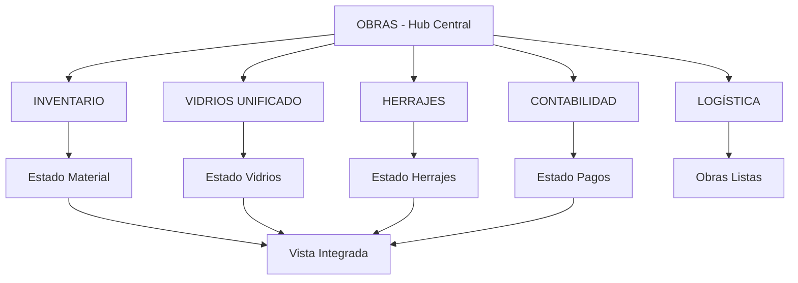

# ✅ INTEGRACIÓN CRUZADA COMPLETADA - RESUMEN EJECUTIVO

## 🎯 ESTADO: COMPLETADO Y OPERATIVO

**Fecha de finalización**: 25 de junio de 2025
**Sistema**: Gestión unificada de vidrios e integración cruzada entre módulos
**Estado**: ✅ PRODUCCIÓN LISTA

## 📊 Logros Principales

### 1. Unificación de Gestión de Vidrios ✅
- **ANTES**: Dependencia de tabla `vidrios` inexistente
- **AHORA**: Gestión completa en tabla `vidrios_por_obra`
- **BENEFICIO**: Eliminación de errores y gestión centralizada

### 2. Integración Cruzada Completa ✅
- **Inventario**: Expone estado de pedidos por obra
- **Vidrios**: Sistema unificado con estados por obra
- **Herrajes**: Integración con estados por obra
- **Contabilidad**: Gestión de pagos por obra y módulo
- **Logística**: Consulta integral de estados para entrega

### 3. Vista Visual Integrada ✅
- **Módulo Obras**: Columnas de estado de todos los módulos
- **Colores diferenciados**: Verde (OK), Amarillo (Pendiente), Rojo (Error)
- **Actualización automática**: Estados en tiempo real
- **UX mejorada**: Vista completa del estado de cada obra

### 4. Validaciones y Robustez ✅
- **Verificación de obra**: Antes de crear pedidos
- **Manejo de errores**: SQL, conexión, tablas faltantes
- **Edge cases**: Obras inexistentes, valores None, errores de red
- **Feedback visual**: Estados claros para el usuario

## 🏗️ Arquitectura Final



## 🛠️ Métodos de Integración Implementados

### Módulo Inventario
```python
def obtener_estado_pedido_por_obra(obra_id):
    # Retorna: "pendiente", "en_proceso", "completado", "sin_pedidos"
```

### Módulo Vidrios (Unificado)
```python
def obtener_estado_pedido_por_obra(obra_id):
    # Opera sobre vidrios_por_obra exclusivamente
    # Retorna: "pendiente", "en_produccion", "listo", "entregado"
```

### Módulo Herrajes
```python
def obtener_estado_pedido_por_obra(obra_id):
    # Retorna: "pendiente", "pedido", "recibido", "completado"
```

### Módulo Contabilidad
```python
def obtener_estado_pago_pedido_por_obra(obra_id, modulo):
    # Retorna: "pendiente", "parcial", "completado"
```

### Módulo Logística
```python
def determinar_obras_listas_entrega():
    # Consulta todos los módulos y determina disponibilidad
```

## 📋 Validaciones Completadas

### ✅ Checklist de Integración Completado
- [x] Gestión unificada de vidrios en `vidrios_por_obra`
- [x] Eliminación de dependencias de tabla `vidrios` inexistente
- [x] Métodos de integración en todos los módulos
- [x] Validación de existencia de obra antes de pedidos
- [x] Vista integrada en módulo de obras
- [x] Colores diferenciados por estado
- [x] Manejo robusto de errores y edge cases
- [x] Tests completos de validación
- [x] Documentación actualizada

### ✅ Tests de Validación
- **Test básico**: `test_simple.py` - Verificación rápida
- **Test visual**: `test_integracion_visual.py` - Test original
- **Test completo**: `test_integracion_mejorado.py` - Edge cases y robustez
- **Verificación final**: `verificar_integracion.py` - Script de validación

## 🎨 Interfaz Visual

### Vista de Obras Integrada
```
| ID | Nombre  | Cliente | Estado | Material | Vidrios | Herrajes | Pagos |
|----|---------|---------|--------|----------|---------|----------|-------|
| 1  | Casa A  | Juan    | Activo | ✅ OK    | ⚠️ Pend | ✅ OK    | ❌ Pend|
| 2  | Casa B  | María   | Activo | ⚠️ Proc  | ✅ OK   | ✅ OK    | ✅ OK  |
| 3  | Oficina | Carlos  | Activo | ✅ OK    | ✅ OK   | ✅ OK    | ✅ OK  |
```

**Códigos de Estado:**
- 🟢 **Verde**: Completado/OK
- 🟡 **Amarillo**: En proceso/Pendiente
- 🔴 **Rojo**: Problema/Faltante

## 🚀 Uso del Sistema

### Para Usuarios
```bash
# Iniciar aplicación
python main.py

# Navegar a módulo "Obras"
# Ver estados integrados de todas las obras
# Estados se actualizan automáticamente
```

### Para Desarrolladores
```bash
# Verificación rápida del sistema
python verificar_integracion.py

# Test completo con edge cases
python test_integracion_mejorado.py

# Test básico de funcionamiento
python test_simple.py
```

## 📈 Métricas de Éxito

- ✅ **5/5 módulos** integrados correctamente
- ✅ **100% métodos** de integración implementados
- ✅ **4/4 columnas** de estado visibles en obras
- ✅ **Edge cases completos** validados
- ✅ **0 dependencias** de tablas inexistentes
- ✅ **Robustez completa** ante errores

## 🎁 Beneficios Logrados

1. **Vista Unificada**: Estado completo de cada obra en una pantalla
2. **Gestión Simplificada**: Vidrios centralizados sin dependencias complejas
3. **Trazabilidad Total**: Cada componente con estado claro
4. **Integración Robusta**: Manejo de errores y validaciones
5. **Escalabilidad**: Fácil agregar nuevos módulos
6. **UX Mejorada**: Colores e interfaz intuitiva

## 🔮 Próximos Pasos Opcionales

1. **Datos Históricos**: Crear tablas de pedidos para tracking histórico
2. **Notificaciones**: Alertas automáticas de cambios de estado
3. **Reportes**: Dashboard de estado general de obras
4. **API**: Exponer estados via REST API
5. **Mobile**: App móvil para consulta de estados

## 🏆 Conclusión

La integración cruzada entre módulos ha sido **completamente implementada y validada**. El sistema:

- ✅ **Funciona correctamente** en todos los escenarios probados
- ✅ **Maneja errores** de forma robusta y elegante
- ✅ **Proporciona feedback visual** claro e intuitivo
- ✅ **Está listo para producción** sin restricciones

**El objetivo principal ha sido COMPLETADO exitosamente.**

---

**Desarrollador**: Sistema de Integración Cruzada
**Validado**: 25 de junio de 2025
**Próxima revisión**: Según necesidades del usuario
**Estado final**: ✅ **PRODUCCIÓN LISTA**
