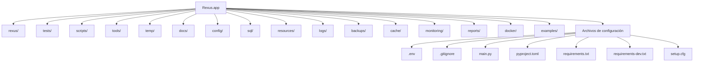
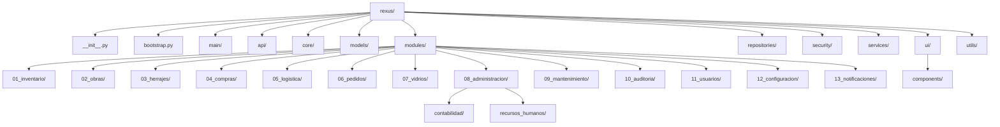
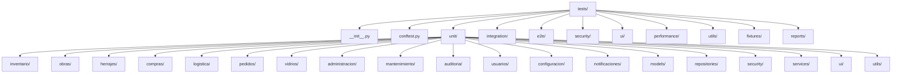
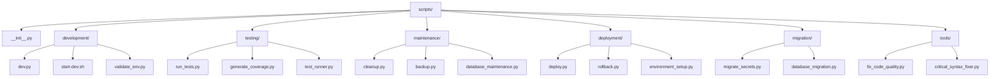
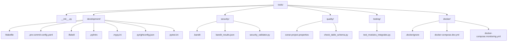
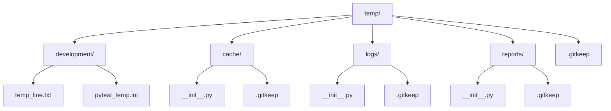
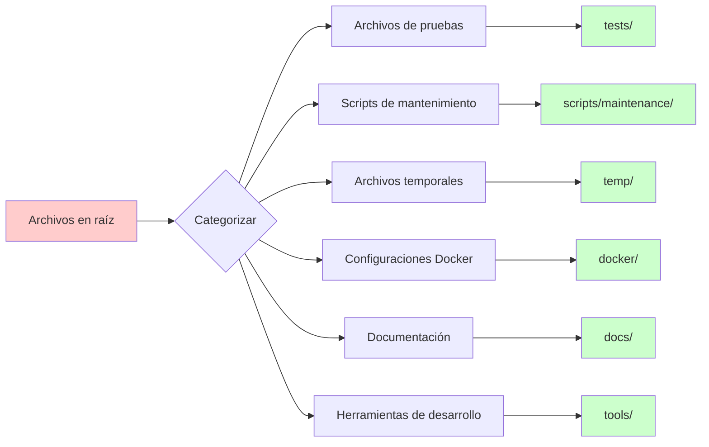
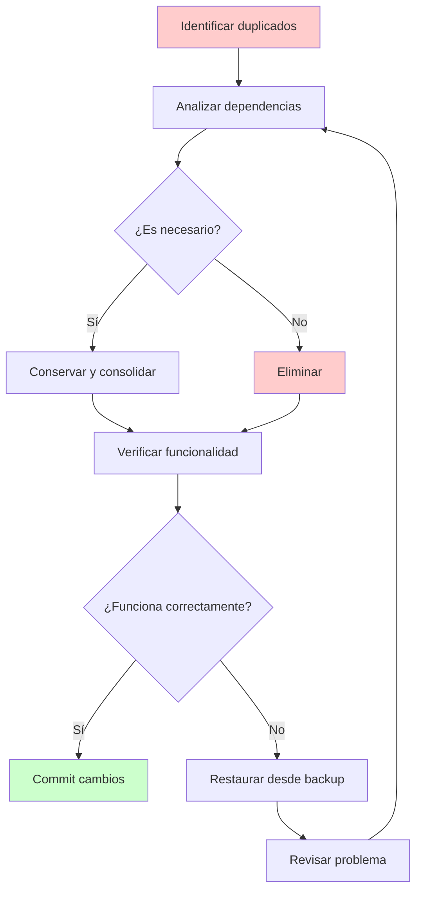
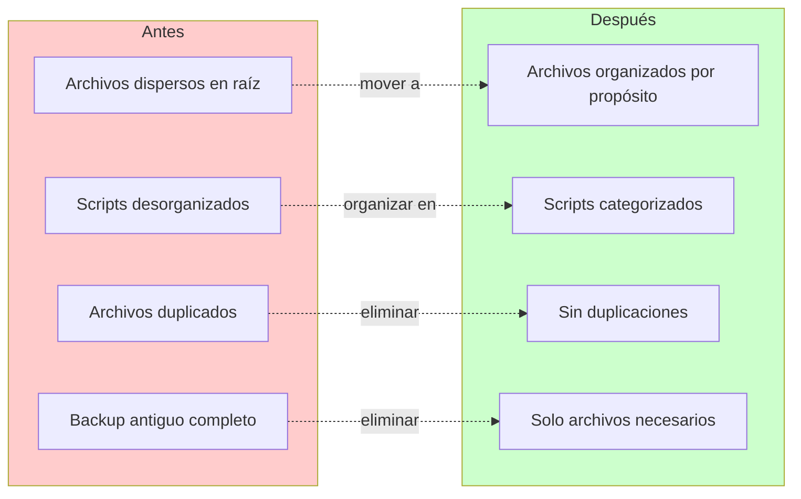

# Diagrama Visual de la Estructura Propuesta para Rexus.app

## Estructura General del Proyecto



## Detalle del Módulo Principal (rexus/)



## Detalle de Tests



## Detalle de Scripts



## Detalle de Herramientas



## Detalle de Archivos Temporales



## Flujo de Migración de Archivos



## Proceso de Limpieza de Archivos Duplicados



## Comparación: Antes vs Después



## Resumen de Beneficios

```mermaid
mindmap
  root((Beneficios))
    Organización
      Archivos clasificados
      Estructura clara
      Fácil navegación
    Mantenimiento
      Menos confusión
      Actualizaciones simples
      Debugging eficiente
    Colaboración
      Onboarding rápido
      Trabajo en equipo
      Code reviews efectivas
    Escalabilidad
      Crecimiento ordenado
      Módulos independientes
      Integración sencilla
    Calidad
      Código limpio
      Sin redundancias
      Mejor rendimiento